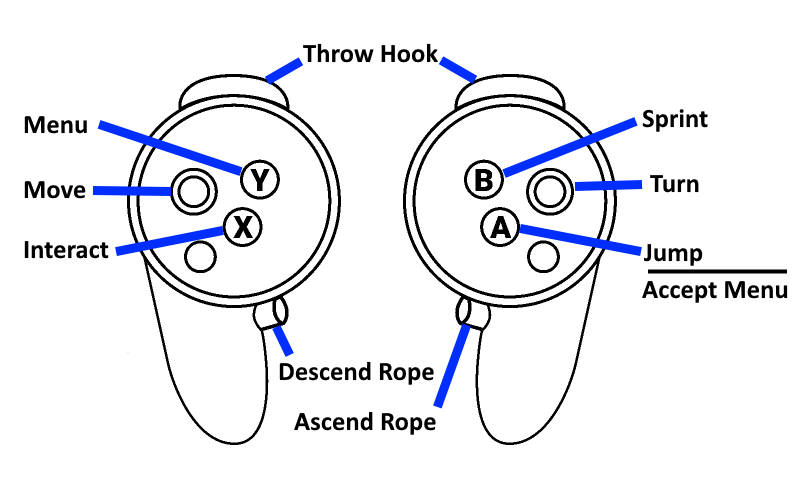

# Idols of Ash VR
This is a fork of Universal Godot VR Injector with some changes to enable the grappling hook to be used with motion controllers. Tested on Quest with Virtual Desktop, with roomscale movement enabled.

## Installation
1. Download the [release zip](https://github.com/LXE97/UGVR-IdolsOfAsh/releases/download/v1.0.0/IdolsOfAsh-VR.zip)
2. Extract it to your IdolsOfAsh directory (next to idols_of_ash.exe)
    - **If you have installed other mods** that came with their own override.cfg, you'll need to merge those manually. For example:
        ````
        [autoload_prepend]
        XRInjector="*res://xr_injector/xr_injector.gd"
        ModLoader="*res://addons/mod_loader/mod_loader.gd"
        ModLoaderStore="*res://addons/mod_loader/mod_loader_store.gd"
        ````
All of the options are located in the XRConfigs folder:
````
idols of ash_xr_game_action_map.cfg         - game keybindings
idols of ash_xr_game_options.cfg            - VR settings
idols of ash_xr_game_control_map.cfg        - misc controller settings
````
## Controls
The VR controller is mapped to Xbox gamepad buttons by `control_map.cfg`, and the game keybindings are configured in `action_map.cfg`. The triggers are hardcoded to fire the grappling hook, but everything else should be configurable.



### Joystick direction
Use `movement_direction_device` in `game_options.cfg` to change the reference for the joystick direction. By default it's set to Head (HMD).
````
0 = HMD
1 = Primary Controller
2 = Secondary Controller
````

#### Menus


## Other Options
Misc options in `game_options.cfg`:
* `use_palm_healthbar`
  * Disable or resize the floating healthbar
* `roomscale_height_adjustment`
* `xr_world_scale`
  * Adjust camera height and VR world scale
* `xr_hand_material_choice`
  * Coose a different hand model:

        0 Transparent hand
        1 Full blue glove            
        2 Half glove dark skinned
        3 No glove light skinned
        4 No glove dark skinned
        5 Full yellow glove
        6 half glove light skinned
* `terrain_collision_fade`
  * Disable the fade-to-black effect when the VR camera goes into a wall
* `apply_player_momentum`
  * Add the player's velocity to grappling hook throws (default game: true, recommended)

## Known Issues
* When you respawn after dying, the first time you pull the triggers it won't fire
* After playing the Credits scene at the end of the map, you may need to restart the game
* Collision is not great when grappling into objects from below

## Credits
Thanks to [ElKameleon](https://github.com/ElKameleon/DescentWithoutDread/tree/main) for the detailed guide on how to set up Godot mods.

Thanks to the creators of UGVR for all their hard work
### [Original UGVR readme](https://github.com/teddybear082/UGVR)

### [The UGVR wiki](https://github.com/teddybear082/UGVR) may be helpful for customization and troubleshooting
